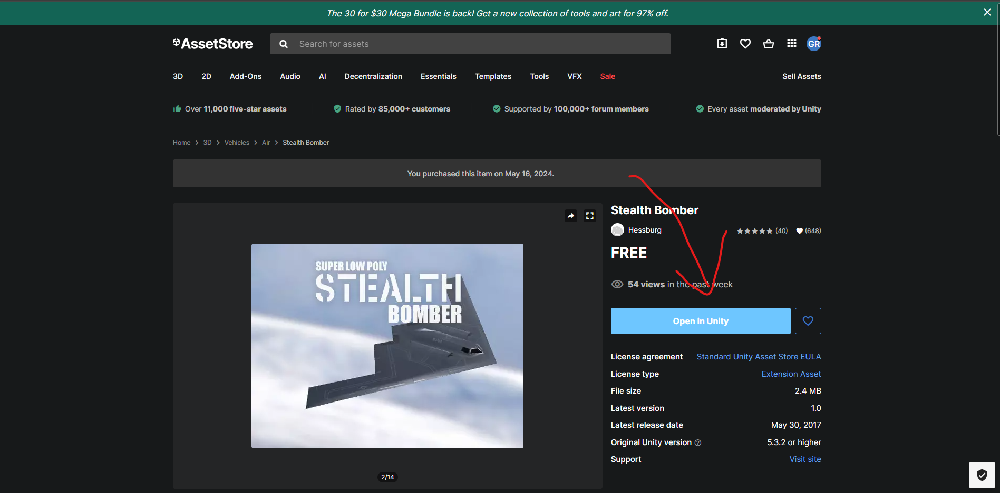
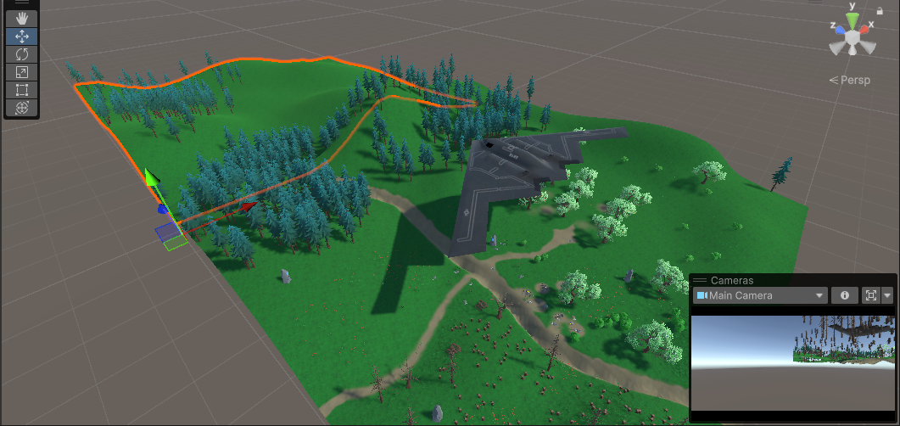
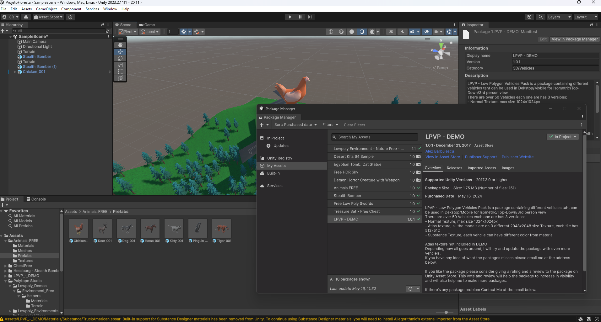
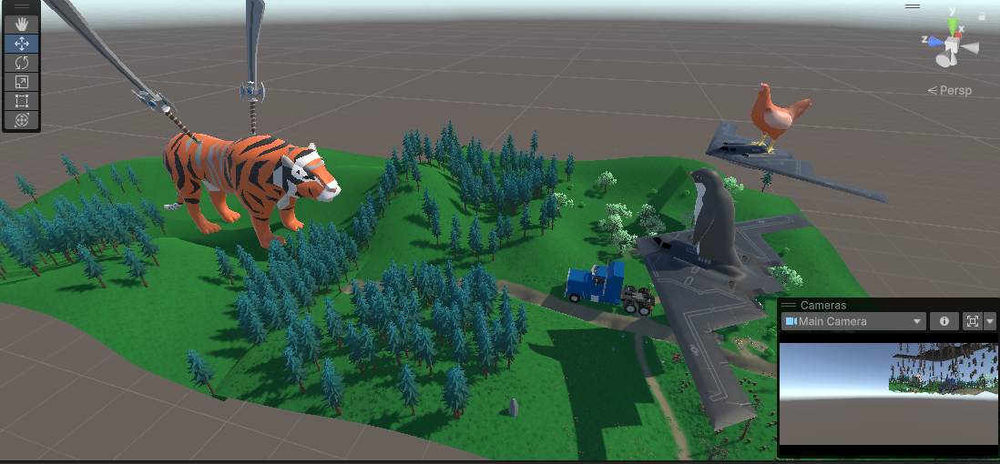
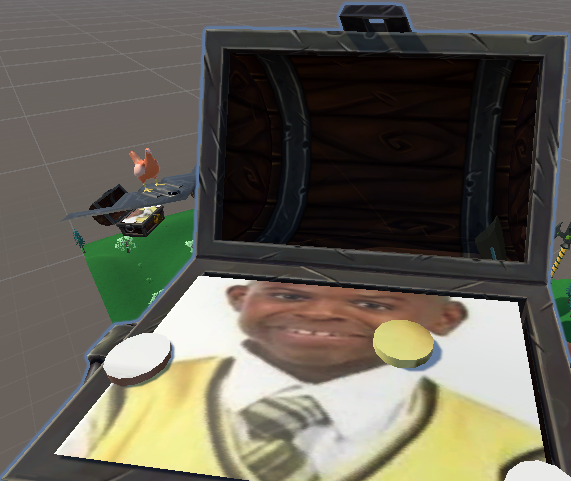
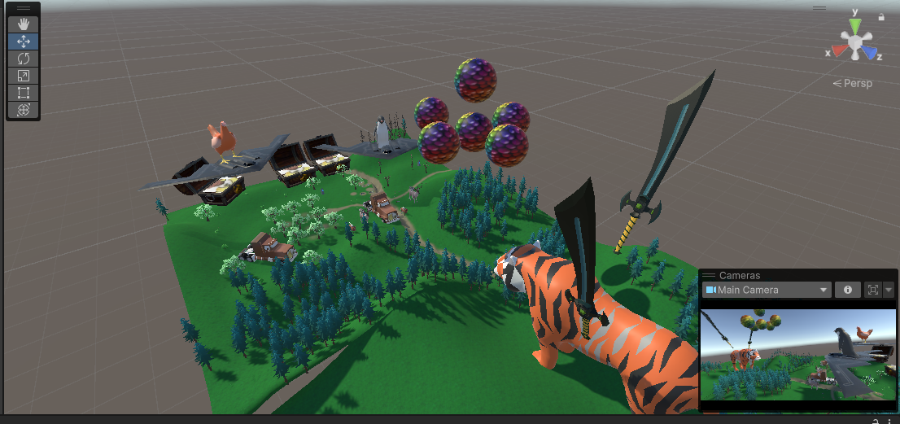
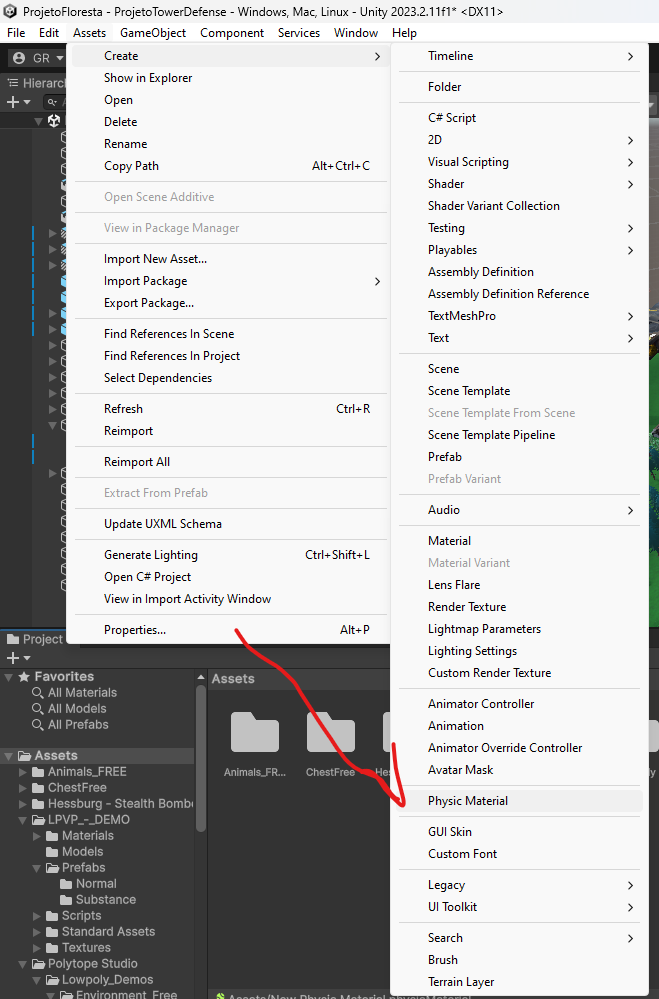
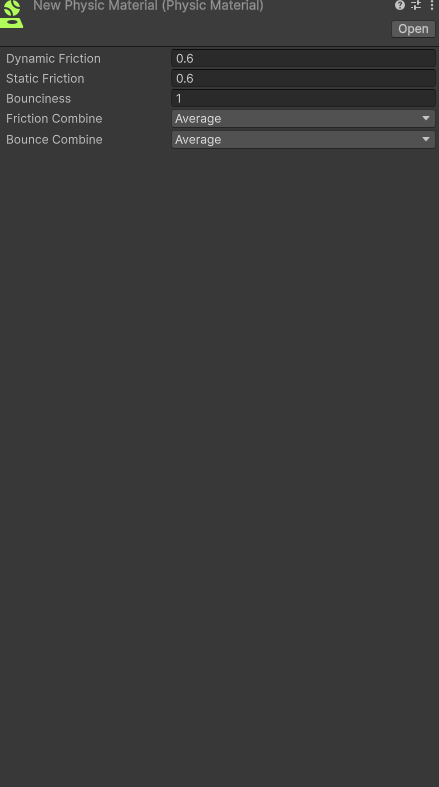
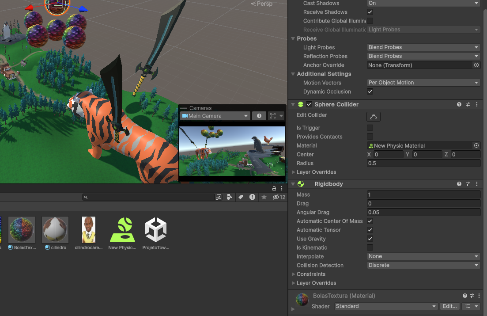

<h1 align="center"><b>Projeto Tower Defense</b></h1>
<h3><i>Por Igor Michelini e Gustavo Rezende</i></h3>
<h3><i>Link para o Drive da cena: </i></h3>https://drive.google.com/file/d/1Eo91_b_xJz3nonb4CwJJFtrCTrIKv_w_/view?usp=drive_link
 

<h1 align="center">Ideia Principal e a História por Trás Dela</h2>
Nós começamos o projeto com um BrainStorm de várias ideias enquanto procurávamos por assets na Asset Store. Até que encontramos um Ambiente de Floresta muito bonito, que dava uma ambientação medieval, e achamos que seria a melhor opção para a ideia atual, que era de uma guerra entre duas nações, algo esperado de um jogo estilo Tower Defense, onde o jogador defende sua área.

Porém, nós acabamos por encontrar este asset:

E como havia assistido <i>Star Wars</i> recentemente, achei que seria muito divertido ter essa mistura entre dois gêneros tão diferentes, e ter essa combinação pode levar a ideias inusitadas ou até engraçadas.

E decidimos levar a esquisitisse a um novo patamar com um asset de animais de fazenda

E decidimos que as duas nações que pensamos poderíam ser substituídas por animais de fazenda, e como queríamos manter a ideia medieval, cada animal teria seu reino, e estariam guerreando por um tesouro maravilhoso, que também já havíamos baixado o asset:

Então decidimos que os animais seriam a Galinha e o Pinguim, e estariam voando em cima das naves para lutar pelo tesouro

Mas... Achamos que ter só dois animais tornava a cena muito vazia, então achamos que ter mais animais seria a solução

Por isso decidimos adicionar o Tigre, e também baixamos um asset de espadas, que serão as armas dele, para lutar contra o Pinguim e a Galinha, que agora são Rei e Rainha do reino e estão lutando contra o Tigre que estava tentando roubar o tesouro deles

Mas, algo ainda estava faltando...
O que seria de um Tower Defense sem tropas aliadas? Então decidimos usar o resto dos animais que não havíamos usado ainda, estes sendo o<i> Cachorro, Gato, Cavalo e Alce</i>
como cavaleiros que estão lá para ajudar a defender o tesouro, mas não só isso.
Mas também adicionamos um asset de Caminhões e Carros urbanos, e adicionamos à cena.

E depois de um tempo, percebemos que as naves também estavam meio vazias, então adicionamos várias bolas, e um material de bolinhas coloridas para atirar no Tigre.

Também decidimos adicionar uma textura do Cirilo de Carrossel para o tesouro:

E assim ficou o resultado final:

<h1 align="center">Como adicionamos os assets</h1>
Primeiro, vá até a Asset Store da Unity, selecione um asset, e clique no botão "Open in Unity"

Depois, abrirá uma tela:

Onde no nosso está escrito "in project", estaria uma opção "Add to project", clique nela e seu projeto terá aquele asset.

<h1 align="center">Como adicionamos a colisão</h1>
Primeiro, clique em "Assets", depois em "Create", e em "Physic material"

Depois, altere os valores para o desejado.

E finalmente, adicione um "RigidBody" ao objeto no qual deseja ter fisica.

Resultado final:

https://github.com/Gutsvo/Projeto-Cena-1/assets/105552293/c8f2fa9d-e967-4b5d-aa1c-a04c547763a6

